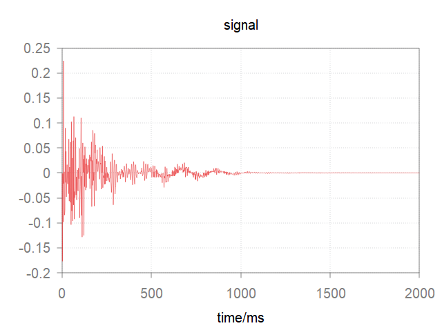
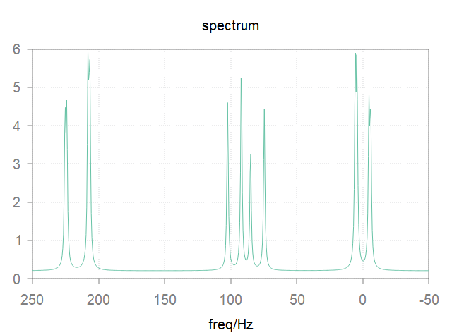

.. sol documentation master file, created by
   sphinx-quickstart on Mon Feb 29 21:49:51 2016.
   You can adapt this file completely to your liking, but it should at least
   contain the root `toctree` directive.

.. image:: media/spin-scenario.png
	:target: https://github.com/spin-scenario/spin-scenario
	:alt: spin-scenario repository
	:align: center

Spin-Scenario |version|
=======================
*a flexible, unified scripting environment for realistic MR simulations*

Get going:
----------

.. toctree::
	:maxdepth: 1
	:name: mastertoc
	
	about
	installation
	tutorial/tutorial-top
	module/spinsys
	module/phantom
	module/seq
	module/oc
	module/physx
	module/utility
	api/api-top
	development
	roadmap
	publication
	license
	contact

the basics:
-----------
.. code-block:: lua
	:linenos:

	 -- scenario A: spin system generation.
        B0{"500 MHz"}
        local acrylic =spin_system{
                spin = "1H 1H 1H",
              zeeman = "2 scalar 88.42 Hz 3 scalar 214.9 Hz",
           jcoupling = "1 2 scalar 10.4 Hz 1 3 scalar 1.2 Hz 2 3 scalar 17.4 Hz"}
        -- scenario B: pulse sequence assembly.
        local rf45 =hardRF{beta =45}
        local adc =acq{np =1024, sw =500}

        local fid =seq{rf45, adc}
        -- scenario C: experimental study.
        result =run{exp =fid, spinsys =acrylic}

|fid_raw| |fid_spec|

.. note::
	The code above and more examples can be found in the `examples directory`_.

Acknowledgments
---------------
Spin-Scenario was supported by National Natural Science Foundation of China 11505281, 11675254.

.. _spin-scenario: https://github.com/spin-scenario/spin-scenario
.. _issues: https://github.com/spin-scenario/spin-scenario/issues
.. _examples directory: https://github.com/spin-scenario/spin-scenario/tree/master/examples

.. |nsfc| image:: media/logo-NSFC.jpg
	:height: 45
	:align: middle	

.. |sibet| image:: media/sibet.png
	:height: 45
	:align: middle

.. |ecnu| image:: media/ecnu.gif
	:height: 40
	:align: middle	

.. |children_hosptial| image:: media/children_hosptial.png
	:height: 45
	:align: middle	

.. |tum| image:: media/tum.gif
	:height: 45
	:align: middle	
