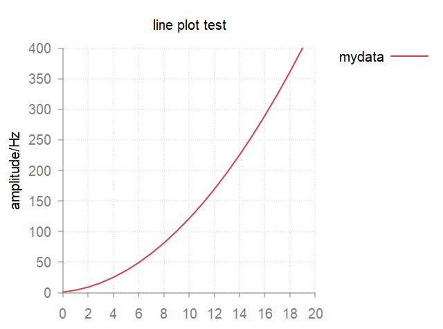
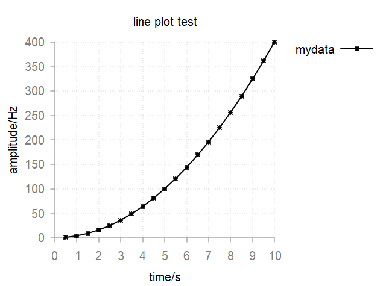
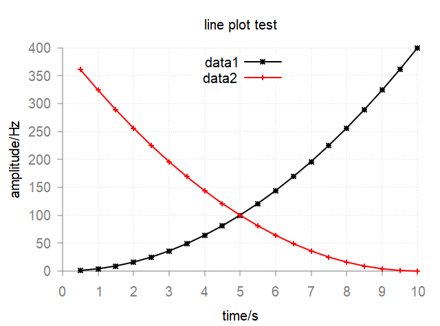
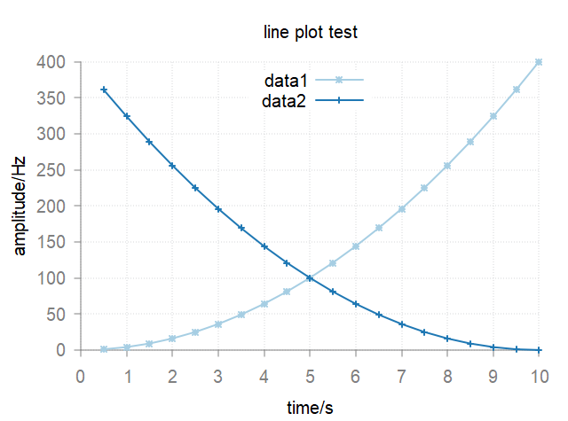
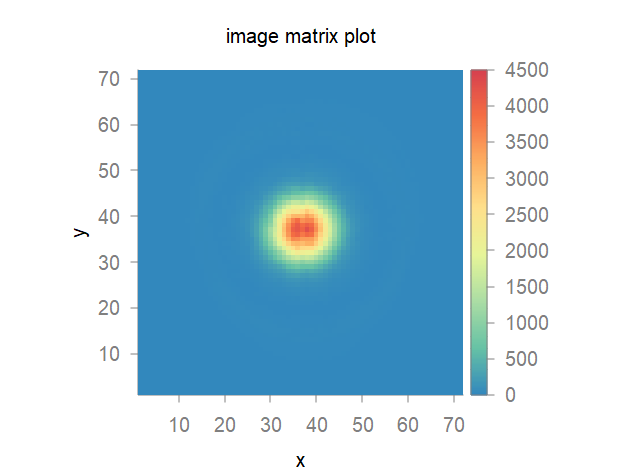
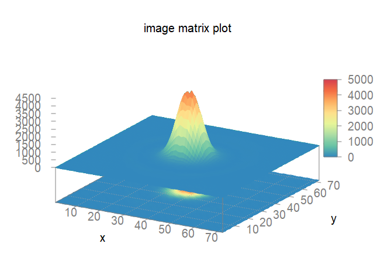
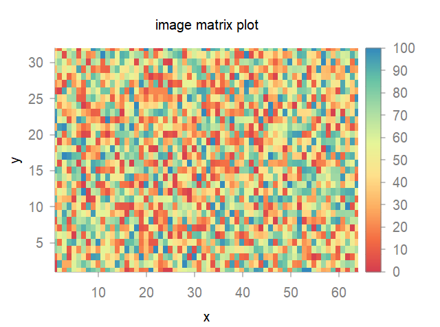

:orphan:

**************
plot
**************

.. contents:: Table of Contents
   :local:
   :depth: 1

.. note::
    Spin-Scenario by default will plot figures using `Gnuplot <http://www.gnuplot.info/>`_  QT interface. If you wish to generate figures stored in computer, please use ``output_terminal`` before the ``plot`` function.

    .. code-block:: Lua
    
      -- available types include qt, png, eps and tex.
      output_terminal{type = "eps", font = "Arial,14"} 

pulse sequence block
==================== 
For sequence block, user can directly call ``plot`` function, and the corresponding figures will be generated automatically. An intuitive usage can be found in :doc:`shapedRF<shapedRF>`.

  .. code-block:: C++

    void plot(sol::variadic_args va, const seq_block & /*sb*/);

lines and matrix
==================== 
For general matrix or vector, same ``plot`` function can be applied.

  .. note::
    Spin-Scenario has three basic data structures for the plotting.
    
    * ``line`` for one line.
    * ``line_series`` for multi lines.    
    * ``map`` for 2-D matrix.
    It is required that the input data type of ``plot`` function should be any one of them.

2-D line plot
------------------
There are several approachs to construct a ``line``.

  .. code-block:: C++
  
    line(string file); // case 1.
    line(const sol::table &y); // case 2.
    line(const sol::table &x, const sol::table &y); // case 3.
    line(const vec &y); // case 4.
    line(const vec &x, const vec &y); // case 5.

Example script to simply plot these lines is as follow:

  .. code-block:: lua

    -- create y vector.
    local y ={}
    for i = 1, 20 do
      y[i] = i*i
    end

    -- case 2.
    plot(line(y))

    -- create x vector.
    local x ={}
    for i = 1, 20 do
      x[i] = i/2
    end

    -- case 3.
    plot(line(x, y))

    -- case 4.
    local vy = table2vec(y)
    plot(line(vy))

    -- case 5.
    local vx = table2vec(x)
    plot(line(vx, vy))

    -- case 1.
    write("vector.txt", vy)
    plot(line("vector.txt"))

To make the figures more flexible, additional args of figures can be specified.
  
  .. code-block:: lua

    plot("args1", line( , "args2"))

  .. note::
    * ``args1`` is related to the figure's properties, e.g. title, labels, legend, line width,  etc. A full ``args1`` can be written as ``title<xx> xlabel<xx> ylabel<xx> legend<xx> xrange<1:10> yrange<2:50> lw<2> gnuplot<xxx>``. The last one ``gnuplot`` is an useful interface for using `Gnuplot <http://www.gnuplot.info/>`_ commands.

A simple example:
  .. code-block:: lua

    plot("title<line plot test> ylabel<amplitude/Hz> legend<mydata> gnuplot<set key outside>", line(y))

This will plot a figure like this.
  |line1|

  .. note::
    * ``args2`` is related to the line's properties, e.g. style, marker, color, dash, etc. ``args2`` can be written as "val1 val2 val3".

Another example:
 .. code-block:: lua

    plot("title<line plot test> xlabel<time/s> ylabel<amplitude/Hz> legend<mydata> gnuplot<set key outside>", line(x,y,"k lp *"))

This will plot a figure like this.
  |line2|

Available options for ``args2`` can be found in :doc:`line-properties<line-properties>`.

Multi lines plot
------------------
Based on the above single line plot, it is quite straight forward to plot multi lines in one figure: just add the additional lines to the end.

.. code-block:: lua

    plot("args1", line( , "args2a"), line( , "args2b"), line( , "args2c"))

A example:

.. code-block:: lua

  local y2 ={}
  for i = 1, 20 do
    y2[i] = (20-i)^2
  end

  plot("title<line plot test> xlabel<time/s> ylabel<amplitude/Hz> legend<mydata> gnuplot<set key center top>", line(x,y,"k lp *"), line(x,y2,"r lp +"))

This will plot a figure like this.
  |line3|

If user does not specify the colors for lines, the ``plot`` function will automatically assign them according the default color schemes in `gnuplot-colorbrewer <https://github.com/aschn/gnuplot-colorbrewer/>`_. You may add  e.g. ``color<Paired>`` to ``args1`` to choose different color scheme.

.. code-block:: lua

  plot("title<line plot test> xlabel<time/s> ylabel<amplitude/Hz> legend<data1;data2> gnuplot<set key center top> color<Paired>", line(x,y,"lp *"), line(x,y2,"lp +"))
  
|line4|

2-D matrix plot
------------------
There are two approachs to construct a matrix (map).

.. code-block:: C++
  
    map(string file); // case 1.
    map(const mat &m); // case 2.

The usage of ``plot`` function is similar to that of ``line``. You can use ``plot("args1", map( , "args3"))``.

.. note::
    "args1" is also the figure's properties. ``args3`` is related to the map's properties, e.g. ``style<image>`` or ``style<3d>``. If ``args3`` is empty, 2d image style will be used.

.. code-block:: Lua

  plot("title<image matrix plot> xlabel<x> ylabel<y> color<Spectral> gnuplot<set palette negative\n set size ratio -1>", map("raw_abs.txt"))

|map1|

.. code-block:: Lua

  plot("title<image matrix plot> xlabel<x> ylabel<y> color<Spectral> gnuplot<set palette negative\n set size ratio -1\n set cbtics 1000>", map("raw_abs.txt", "style<3d>"))

|map2|

It is also  possible to plot a matrix data from Lua table.

.. code-block:: Lua

  local usr_table ={}
  local nrows, ncols = 32, 64
  for i = 1, nrows do
    for j = 1, ncols do
    usr_table[(i-1)*ncols+j] =  math.random(100)
    end
  end

  local m = table2mat(usr_table, nrows, ncols)
  
  plot("title<image matrix plot> xlabel<x> ylabel<y> color<PiYG>", map(m))

|map3|

