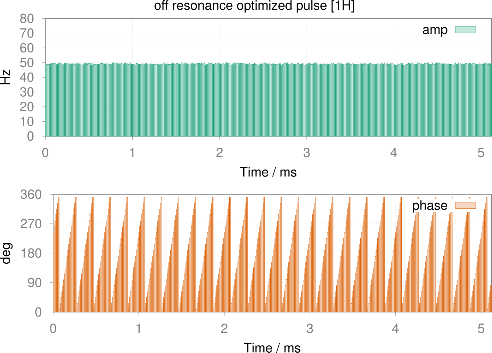
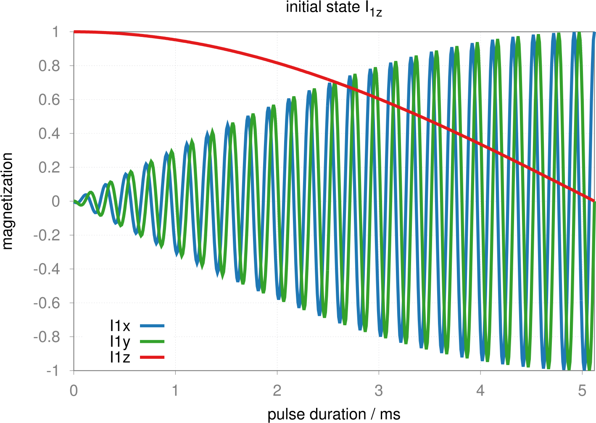
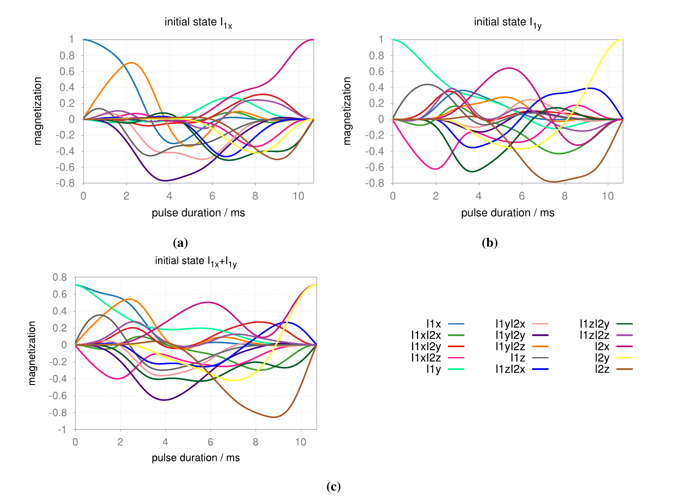
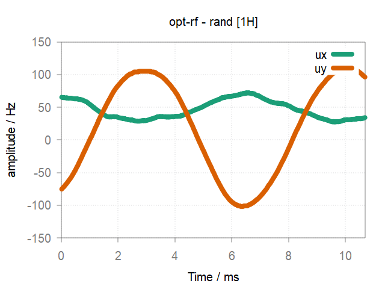
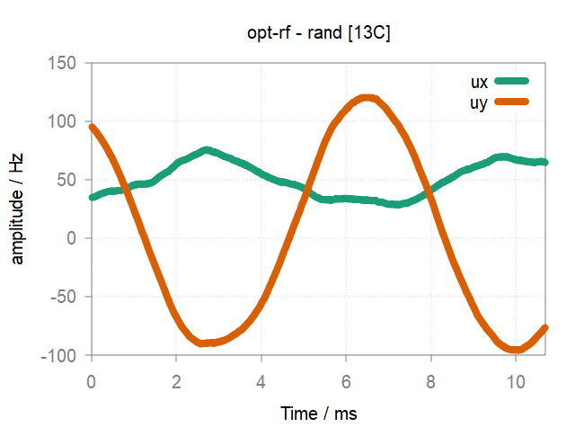

:orphan:

***************************
Shaped Pulse Optimization
***************************
For single pulse optimization, we can use **rf_optimizer**.  Turn to :doc:`multi_rf_optimizer<multi_rf_optimizer>` for cooperative pulses optimization.

* **Pulse optimization**
------------------------
  
  The procedure can be divided into three stages: :doc:`spin system<../spinsys>` set up, pulse optimizer initialization and optimization.

  .. code-block:: lua 
        
        local sys = spin_system(config)    -- 1. spin system set up.
        local oc = rf_optimizer(sys)       -- 2. pulse optimizer initialization.
        local opt_pulse = oc:optimize{}    -- 3. pulse optimization.

  The parameter structure for **optimize** is summarized as follow:

  .. list-table:: 
    :header-rows: 1
    :widths: 25 35 140

    * - Parameter
      - Mandatory/Optional
      - Content
    * - width
      - M
      - Pulse duration in ms.
    * - step
      - M
      - Discrete pulse steps.
    * - init_pattern
      - O
      - Inital waveform pattern, described by a string, default is ``"rand_spline"``. see `pattern` in the parameter structure of :doc:`shapedRF<shapedRF>` for details.
    * - max_init_amp
      - O
      - Maximum amplitude in Hz, useful for scaling inital pulse shape.
    * - init_state
      - O
      - Inital state of spin system, described by a string, e.g. ``"I1z+I2z"``.
    * - targ_state
      - O
      - Target state of spin system, described by a string, e.g. ``"I1x+I2y"``.
    * - targ_op
      - O
      - Target unitary propagator of spin system, described by a string, e.g. ``"I1xI2x+I1yI2y+I1zI2z"`` will define an isotropic mixing propagator exp{-i*pi*(I1xI2x+I1yI2y+I1zI2z)}.
    * - limit_channel
      - O
      - Specify the desired channel considered for the optimization. E.g. ``limit_channel ="1H"``.
    * - limit_axis
      - O
      - Specify the desired component of the involved channels. E.g. ``limit_axis = "x"``, valid parameters are ``"x"`` or ``"y"``.
    * - algorithm
      - O
      - Specify the optimization algorithm, default is ``"LBFGS"``.
    * - max_eval
      - O
      - Specify the maximum iteration steps for the optimization.
    * - xtol_rel
      - O
      - Specify a fractional tolerance on the pulse shape parameters.
   
 .. note::
	  
    * `init_state` and `targ_state` are required for state transfer. 
    * `targ_op` is required for unitary transformation. 

* **Optimal pulse**
------------------------
  
  The optimized pulse is essentially a :doc:`shapedRF<shapedRF>`, thus all related operations are available for the optimal pulse.

  We also provides a **projection** function inside **rf_optimizer** to observe the evolution trajectory components of the interested state.
  
  .. code-block:: lua 
        
        oc:projection{}

  The parameter structure for **projection** is summarized as follow:

  .. list-table:: 
    :header-rows: 1
    :widths: 25 35 140

    * - Parameter
      - Mandatory/Optional
      - Content
    * - rf 
      - M
      - The optimized pulse object.
    * - init_state
      - M
      - Inital state of spin system, described by a string, e.g. ``"I1z+I2z"``.
    * - observ_states
      - M
      - List of observed states, described by a Lua table, e.g. ``{"I1z", "I1x", "I1y"}``. Note if you wish to observe all basis states of the spin system, just assign an empty table ``{}``.
    
* **Demo script**
------------------------

  * State transfer
  
    The follow example script for an off-resonance 90 degree pulse optimization is self-explanatory.
    
    .. literalinclude:: ../../media/oc/oc1.lua
        :linenos:

    |1spin_opt_pulse| |1spin_opt_pulse_traj1|

  * Unitary transformation

    The follow example script demonstrates optimizing isotropic mixing pulse (tp=1.5/J) for heteronuclear spin system.

    .. literalinclude:: ../../../../examples/oc/2spin_mix.lua
        :linenos:

    |2spin_mix_pulse_1H| |2spin_mix_pulse_13C|
    |2spin_mix_pulse_traj|

