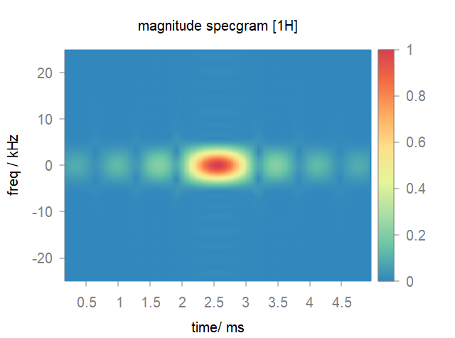
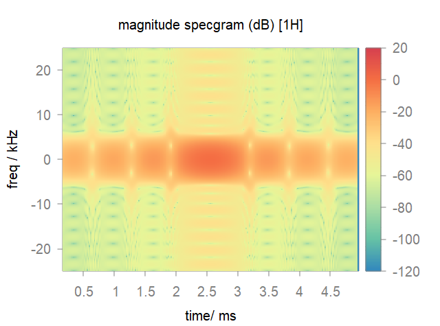

*********
shapedRF
*********
Shaped pulses has been widely used to increase excitation bandwidth, achieve desired profile over the entire bandwidth, and improve polarization and coherence transfer efficiencies in numerous NMR experiments. To this end, **shapedRF** was provided as a general interface for routine patterns (such as Sinc, Gaussian, Rectangle, etc.), external shape files and complex mathematical expressions. 

Turn to :doc:`hardRF<hardRF>` for most common used rectangle or hard pulses.

.. contents::
   :local:
   :depth: 2
   
Create a pulse
==============
  
  The syntax to create a shaped pulse is simple:

  .. code-block:: lua 
        
        local rf = shapedRF{}

  The parameter structure is summarized as follow:

  .. list-table:: 
    :header-rows: 1
    :widths: 25 35 140

    * - Parameter
      - Mandatory/Optional
      - Content
    * - width
      - M
      - Pulse duration in ms.
    * - pattern
      - M
      - Waveform pattern, described by a string.     
       
        **(1) Routine patterns**. valid types include ``"rect"``, ``"sinc"``, ``"gauss"``, ``"hamming"``, ``"rand"``, ``"rand_spline"``. Note that the default maximum amplitude is normalized as 1 Hz. 

        **(2) Mathematical expressions**. You can define an analytical waveform wih the syntax of computer algebra system `YACAS <http://www.yacas.org/>`_, e.g. ``"2*(10-t) + 5*Cos(10*t)^2"``.       

        **(3) External files**. External shape can be imported by the file name with suffix ``".RF"``. Click :download:`2ms_amp_phase.RF <../../media/seq/2ms_amp_phase.RF>` and :download:`2ms_ux_uy.RF <../../media/seq/2ms_ux_uy.RF>` for sample files to generate customized pulses in **amp/phase** (Hz/deg) and **ux/uy** (Hz/Hz) modes respectively. Note that for the phase range in amplitude-phase mode, both [-180~180] and [0-360] are supported. 
    * - step
      - O
      - Pulse steps. For pulse shape created by **routine patterns** or **mathematical expressions**, `step` is required.
    * - max_amp
      - O
      - Maximum amplitude in Hz, useful for scaling pulse generated with **routine patterns**.
    * - mode
      - O
      - Pulse format, default is ``"amp/phase"``. If your external shape is in **ux/uy** mode, ``"ux/uy"`` should be explicitly specified.
    * - channel
      - O
      - Nuclear isotope(s) for this pulse, default is ``"1H"``. For other nuclei, explicit nuclear isotope such as ``channel = "13C"`` or ``channel = "1H|13C"`` is required. Note for more channels, you only need to seperate the phase for each channel with **|**.       

Pulse operation
===============
Pulse plot
-----------

    .. code-block:: lua 
        
        plot(rf)
  
Mode switch
-----------

    .. code-block:: lua 
        
        rf:switch("ux/uy")      -- into ux/uy mode.
        rf:switch("amp/phase")  -- into amp/phase mode.

Pulse save
-----------

    .. code-block:: lua 
        
        write("raw.RF", rf) -- pulse shape will be stored in customized format of spin-scenario.

Export pulse
------------

    .. code-block:: lua 
        
        rf:export("bruker", "exp.RF") -- pulse shape will be exported as specified ("bruker" and "varian" currently supported).

Time-frequency analysis
------------------------
    
    We provide a STFT based function **specgram** for the characteristics of shaped pulse.

    .. code-block:: lua 
        
      specgram{}

    The parameter structure is summarized as follow:

      .. list-table:: 
        :header-rows: 1
        :widths: 25 35 140

        * - Parameter
          - Mandatory/Optional
          - Content
        * - rf 
          - M
          - The pulse object..
        * - wlen 
          - M
          - Window length.
        * - window
          - O
          - Window function in string such as ``"hammning"`` (default) , ``"gauss"``, etc. 
        * - overlap
          - M
          - Overlap ratio.
        * - nfft
          - M
          - FFT number.
        * - style
          - O
          - Output style of the figure in string. ``"amp"`` for the magnitude specgram, ``"dB"`` for the magnitude specgram in 20*log and ``"phase"`` for the phase specgram.

      .. note::
	  
        The pulse shape should be in ``ux/uy`` mode before the specgram analysis.

Demo script
===========

  .. literalinclude:: ../../../../examples/seq/rf/shapedRF.lua
	  :linenos:

  |rf_sinc|

  |stft_amp|  |stft_db|

  |rf_shape_file|

  |rf_expr|

.. |rf_shape_file| image:: ../../media/seq/rf_shape_file.png
  :height: 320
  :align: middle

.. |rf_expr| image:: ../../media/seq/rf_expr.png
  :height: 320
  :align: middle  