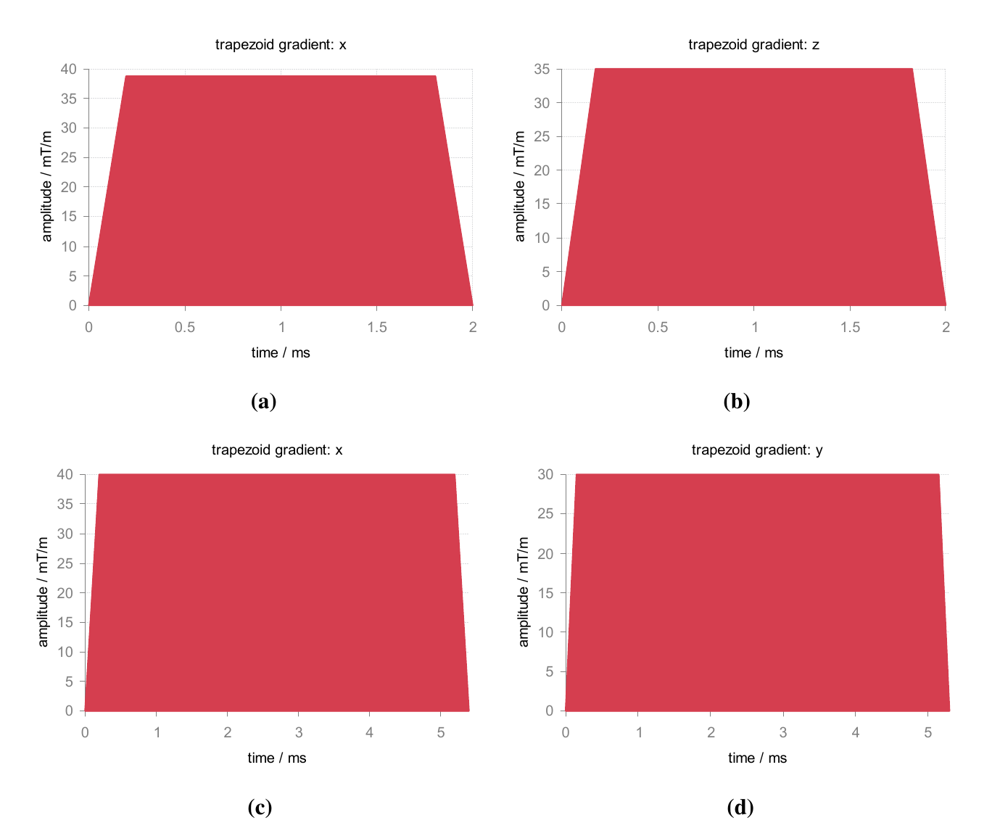

:orphan:

*********
trapGrad
*********
For trapezoidal gradient, it is efficient to specify both ``width`` and ``area`` of a desired gradient, and the lobe shape will be automatically generated according to the peak gradient strength as well as the slew rate of a specific gradient system. 

     .. code-block:: lua 

       peak_grad{40} -- T/m
       slew_rate{200} -- T/m/s
       g1 = trapGrad{axis ="x", width = 2, area = 70} 
       g2 = trapGrad{axis ="z", width = 2, amp = 35}
       g3 = trapGrad{axis ="x", flat_time = 5, amp = 40}
       g4 = trapGrad{axis ="y", flat_time = 5, flat_area = 150}

|trap_grad|

