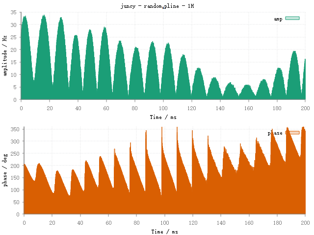
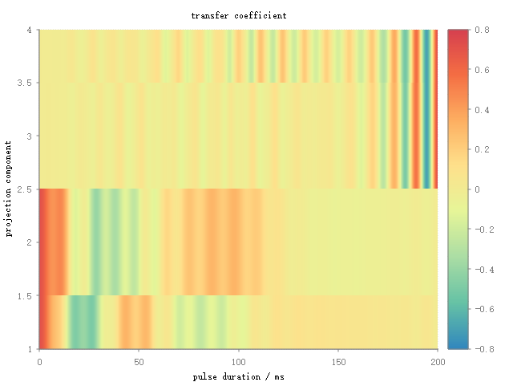
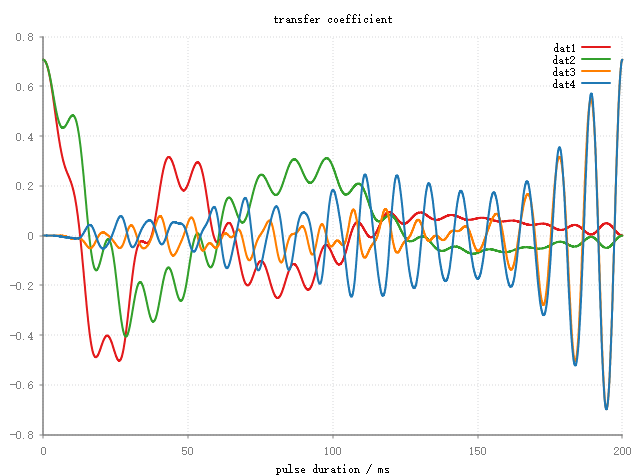
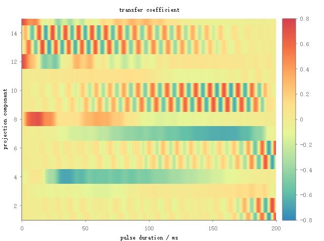
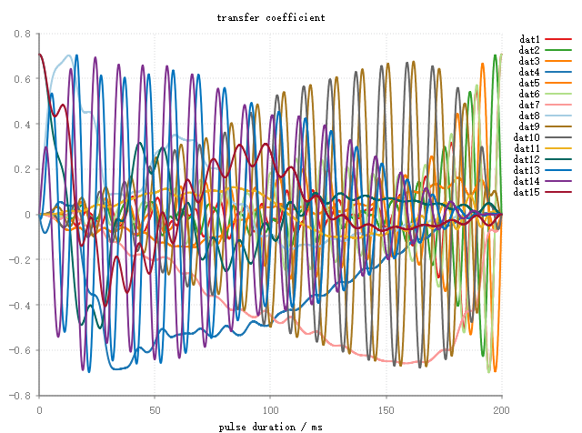

***************
Optimal Control
***************

.. contents::
   :local:
   :depth: 1

Shaped pulse optimization
==========================
how to optimize a single pulse
------------------------------
   .. code-block:: lua 

        -- set up spin system.
        B0{"500 MHz"}
        local config = {
        spin = '1H 1H',
        zeeman = '2 scalar 91 Hz', 
        jcoupling ='1 2 scalar 3.2 Hz'}
 
        local sys = spin_system(config) 
        local oc = rf_optimizer(sys)
        local opt_pulse = oc:optimize{width = 200, step = 4000, init_state = 'I1z+I2z', targ_state = 'I1xI2x+I1yI2y', max_eval = 100}
        print('maximum fidelity: '.. oc.maxf)

evolution trajectories for selected states
------------------------------------------
    .. code-block:: lua

        oc:projection{init_state = 'I1z+I2z', rf = opt_pulse, observ_states = {'I1z', 'I2z', 'I1xI2x', 'I1yI2y'}}

|2spin_traj1| |2spin_traj2|

evolution trajectories for all states
-------------------------------------
    .. code-block:: lua

        oc:projection{init_state = 'I1z+I2z', rf = opt_pulse, observ_states = {}}
    
|2spin_traj3| |2spin_traj4|

Cooperative pulses optimization
===============================
Coming Soon.

