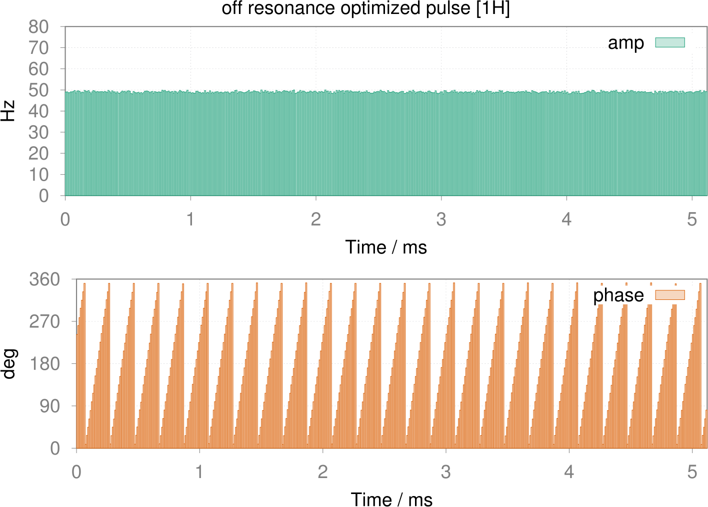

***************
Optimal Control
***************

.. contents::
   :local:
   :depth: 1

Shaped pulse optimization
==========================
For single pulse optimization, we can use **rf_optimizer**.  The follow example script for an off-resonance 90 degree pulse optimization is self-explanatory.
 .. literalinclude:: ../media/oc/oc1.lua
	  :linenos:

|1spin_opt_pulse|

There are also some advance options as bellow for the optimization.
 
 * **limit_channel** to specify the desired channel considered for the optimization. E.g. ``limit_channel ="1H"``.
 * **limit_axis** to specify the desired component of the involved channels. E.g. ``limit_axis = "x"``, valid parameters are ``"x"`` or ``"y"``.
 * **max_eval** to specify the maximum iteration steps for the optimization.
 * **xtol_rel** to specify a a fractional tolerance on the pulse shape parameters.

We provides a ``projection`` function to observe the evolution trajectory components of the interested state:
    .. code-block:: lua

        oc:projection{init_state = "I1z", rf = rf90, observ_states = {"I1z", "I1x", "I1y"}}

|1spin_opt_pulse_traj1|

If you wish to observe all components state of the spin system, just keep the ``observ_states`` to be empty. 
    .. code-block:: lua

        oc:projection{init_state = "I1z", rf = rf90, observ_states = {}}
Cooperative pulses optimization
===============================
Coming Soon.

.. |1spin_opt_pulse_traj1| image:: ../media/oc/1spin_opt_pulse_traj1.png
	:height: 320
	:align: middle
