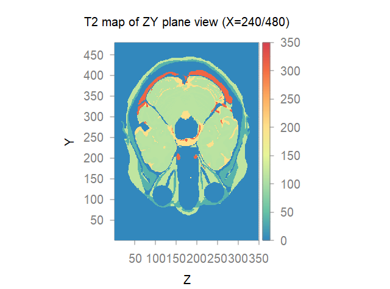
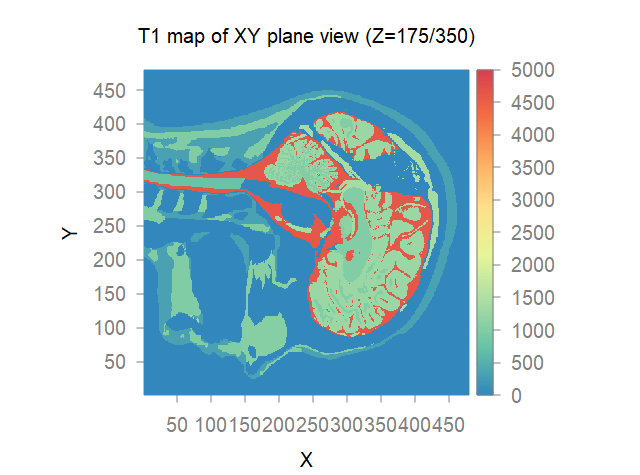

*******
Phantom
*******

Phantom model is essential to perform a MRI simulation. Basicly a digital phantom can be described with a group of multidimensional matrix (usually 3D), which contains necessary physical distributions such as T1 and T2. Alternatively, a more flexible way is to use **an unique matrix to describe the tissue distribution**, in which voxels corresponding to the same tissue have identical element value (e.g. 12 for brain white matter, 0 for background). Moreover, a parameter list can be attached to further describe the corresponding material properties (T1, T2, and so on). 

Phantom visualization
=====================
As mentioned above, to load a phantom, both tissue distribution file (in **HDF5** format) and its parameter list file are required.
     .. code-block:: lua 
           
       local mida = phantom("mida.h5", "mida_config.txt")

The parameter list data contains at least three columns and each row describes a corresponding tissue property like ``1 1260 109``, which means tissue index 1, T1 time 1260 ms and T2 time 109 ms respectively.

To view slices along different directions：

     .. code-block:: lua 
           
       mida:view{x=240, y=240, z=175} 

|mida1| |mida2| |mida3|

By default, the T2 map of specified slices are shown. There is also an additional option ``prop`` to specify map type. E.g. 
     .. code-block:: lua 
           
       mida:view{prop="T1", z=175}
gives a T1 map at slice number 175 along z axis.

|mida4|

How to create phantom
=====================
We provide following demo scripts (Matlab) for researchers to design their own phantom models in Spin-Scenario. There is also a C/C++ :download:`routine <../../../examples/phantom/convert-mhd-phantom-to-spinscenario-h5.rar>` to convert a 3D mhd phantom into Spin-Scenario's h5 format, written and shared by Dr. Jörg Peter from German Cancer Research Center (DKFZ).

2D phantom 
-----------

  .. literalinclude:: ../../../examples/phantom/h5_phantom_2d.m
    :language: matlab
    :linenos:     

.. code-block:: lua 
    
    local p1 = phantom("circles.h5", "config.txt")
    p1:view{prop="T1", z=1}  

|circles|

3D phantom 
-----------

  .. literalinclude:: ../../../examples/phantom/h5_phantom_3d.m
    :language: matlab
    :linenos:     

.. code-block:: lua 
    
    local p2 = phantom("spheres.h5", "config.txt") 
    p2:view{x=100, y=30, z=50} 

|spheres1| |spheres2| |spheres3|

  

