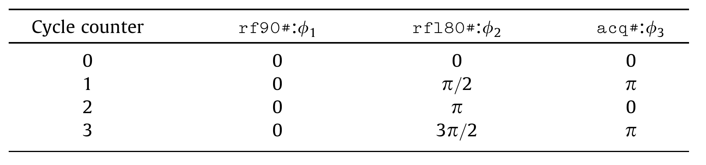
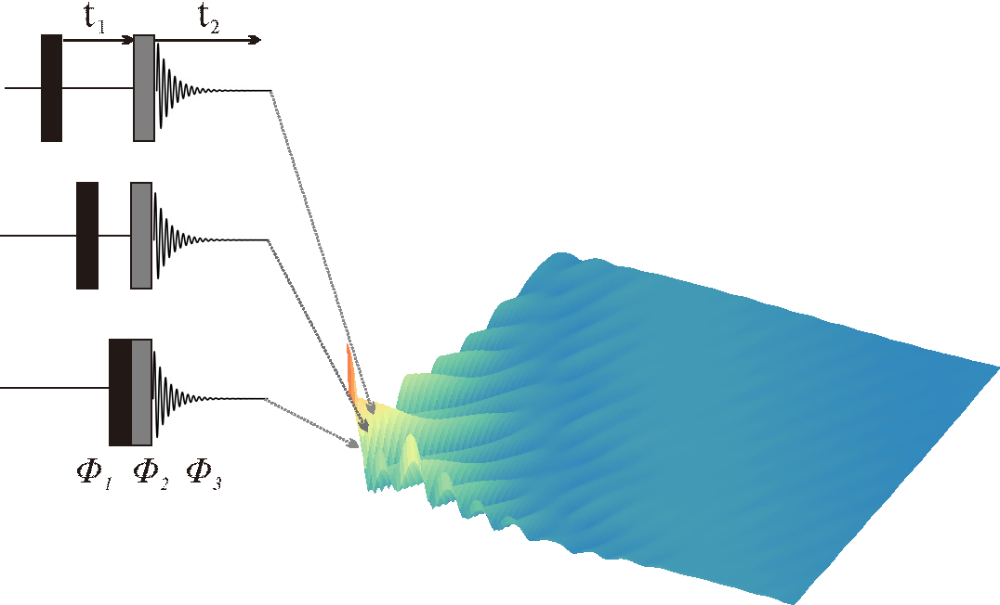

**************************
Pulse Sequence Programming
**************************
.. contents::
   :local:
   :depth: 2

Coming Soon. Please refer to our  recent `publication <https://doi.org/10.1016/j.jmr.2019.01.016>`_ for more information.

Sequence block 
===============

RF pulses
---------
Radiofrequency pulse or RF pulse is a temporary burst of radio waves which serves as a basic element of any pulsed NMR experiment. 

  * :doc:`hardRF<functions/hardRF>`, for most common used rectangle or hard pulses.
  * :doc:`shapedRF<functions/shapedRF>`, for shaped pulses.

Gradient pulses
---------------
The pulsed field gradients are most-often used in MR pulse sequence either for spatial-encoding in imaging or rephasing (selection) and dephasing (elimination) of a particular magnetization transfer pathway in spectroscopy. This library offers :doc:`trapGrad<functions/trapGrad>`, :doc:`shapedGrad<functions/shapedGrad>` and :doc:`exprGrad<functions/exprGrad>` to create three-axis gradients from the typical trapezoidal type, custom defined pattern file and mathematical expression individually. 

  * :doc:`trapGrad<functions/trapGrad>`, for most common used trapezoidal gradient.
  * :doc:`shapedGrad<functions/shapedGrad>`, for gradient generated from external shaped file.
  * :doc:`exprGrad<functions/exprGrad>`, for gradient generated by mathematical expression following `YACAS <http://www.yacas.org/>`_ regulations.

Delays
------
We simply provide :doc:`delay<functions/delay>` to create the specific width of delays for pulse sequences.

Acquisition
-----------
The data acquisition block :doc:`acq<functions/acq>` was designed for signal observation, which simulate the quadrature detection of the receiver in MR scanner. 

Sequence assembly 
=================
In Spin-Scenario, each sequence always starts with a keyword ``seq``, followed by a pair of braces, containing the sequence body. The sub-blocks are separated by default in the body via commas or semicolons (s1). The concurrent or parallel block can be simply assembled through an arithmetic operator ``+``. E.g. ``rf + gz`` defines a selective excitation event, and ``gx + gy + gz`` defines a simultaneous X/Y/Z gradient event. The newly built concurrent blocks can be directly inserted into any position of the pulse sequence (s2). The sequence can be also written in multi-line style, which may be intuitive for more sophisticated sequences.

  .. literalinclude:: ../media/seq/s1s2.lua

It should be noted that pulse sequences can be also nested inside any other sequence, since they themselves are essentially serial blocks. This feature allows the reuse of predesigned pulse sequence templates, which may further improve the scripting efficiency. 

**Arrayed experiments** are widely employed in both MR imaging and MR spectroscopy. To this end, a simple and flexible **loop syntax** is specially designed. Basically, the sequence repetitions include both global and local loops. A specific block followed by a global symbol **#** indicates a series of separate experiments is conducted, with the block taking a set of different values. E.g. 

  .. code-block:: lua 
    
    seq{rf90I, tau#, rf180, tau#, rf90, acq}
describes a modified INEPT arrayed experiments where the S-spin signal is observed immediately after it has been transferred from I for a set of varied time in delay block ``tau``. 

The above idea is also shared with phase cycling for r.f. pulses as well as signal acquisition. Consider, for example, a suitable table for the spin echo experiment 

  .. code-block:: lua 

    seq{rf90#, t1, rf180#, t2, acq#} 
is given in table below. 

|phase_list|

The phases for ``rf90``, ``rf180`` and ``acq`` are **x**, **xy-x-y** and **x-x** respectively, so the total number of steps (n = 4) in the phase cycle is dominated by the maximum cycle counts of all relevant blocks, while other blocks with smaller cycle number will repeat themselves during the complete repetitions.

Further, to perform two-dimensional, three-dimensional or higher-dimensional experiments in  {Spin-Scenario}, the arraying concept was generalized by assigning an additional cycle priority behind the symbol **#**. Then the experimental hierarchy can be logically divided into levels like outer level and inner level. Taking a two-dimensional COSY sequence enclosing phase cycling for example, as shown below

|cosy|

each row of the data matrix is the result of a complete set of phase cycled experiments, all with the same value of **t1**, but with similar cycling of the phases **phi1** , **phi2** and **phi3** according to the phase table. When acquisition of one row is completed, the variable delay **t1** is changed, and the acquisition procedure is repeated. The kernel script of this experiment is then 

  .. code-block:: lua 

    seq{rf90a#2, t1#1, rf90b#2, acq#2}

The biggest priority number always indicates the innermost loop, which represents the phase cycling in this case.

For local loops definition within each TR repetition,  e.g. multi-echo acquisitions in EPI sequence s3, the symbol **~** is adopted to represent the repetitive echo-train within the effective TE. Similar to the symbol **#**, the local loop count is automatically determined by the specific varied block ``gx``.

  .. code-block:: lua 
  
      local s3 = seq{rf + gz,
                    gxPre + gyPre# + gzReph,
                    delay1,
                    (gx + gy + acq)~,
                    delay2}

The syntax for pulse sequence programming is minimalism but highly flexible. The isolated definition of individual blocks, together with one-line assembly of sequence, offer a WYSIWYG way of understanding the pulse sequence structure. 

