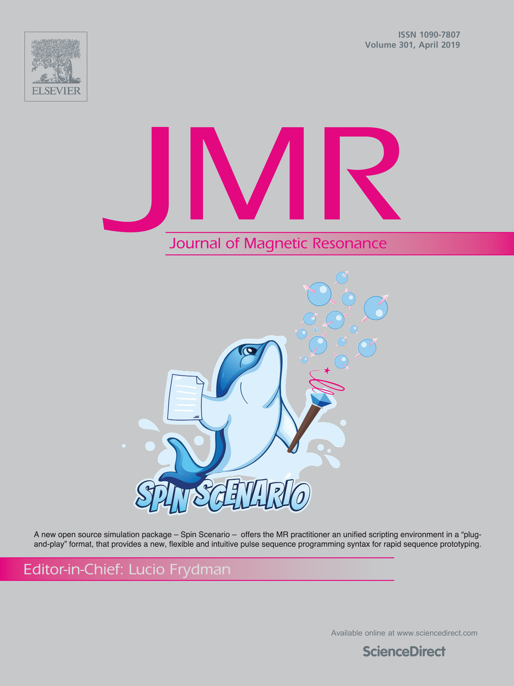

Publication
===========
*Yan Chang, et al. "Spin-Scenario: A flexible scripting environment for realistic MR simulations." Journal of Magnetic Resonance 301 (2019): 1-9.*

The journal article for Spin-Scenario can be found here :download:`PDF <media/Chang2019.pdf>`

To cite Spin-Scenario using a BibTeX entry :download:`BIB <media/S1090780719300229.bib>`

|cover_article|

