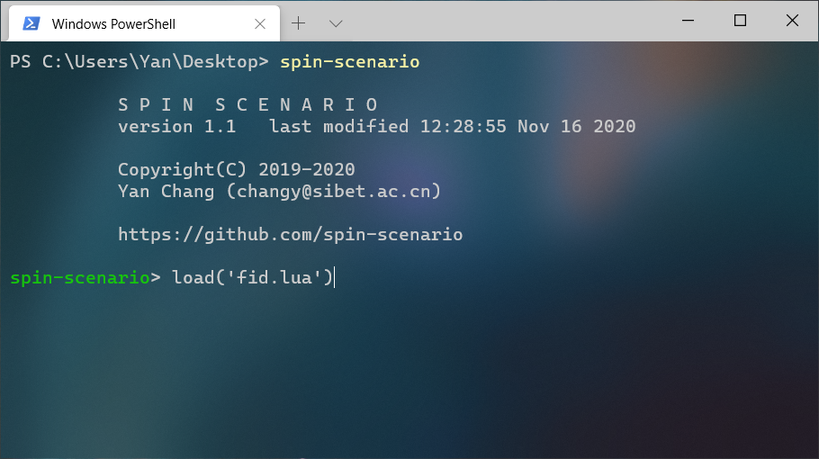

Tutorial
========

.. toctree::
   :caption: sol Tutorial
   :name: tutorialtoc
   :maxdepth: 2

starting the Spin-Scenario environment
----------------------------------------
* Open the terminal and start the environment with ``spin-scenario``.
* To run a scenario script, simply use the command like ``load("fid.lua")``.
* To switch to old script, just use ``up`` and ``down`` key.
* To quit the program, use ``q``.

|cmd_screen|

.. _examples: https://github.com/spin-scenario/spin-scenario/tree/master/examples

